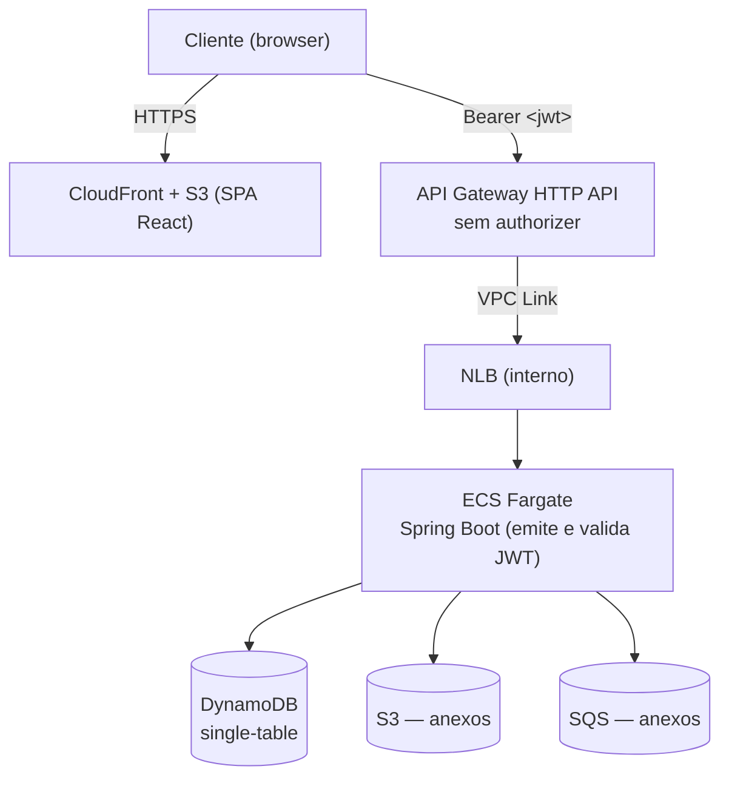
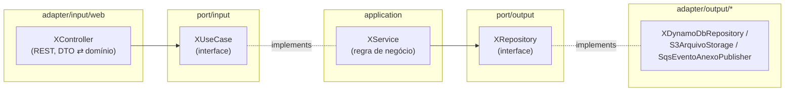
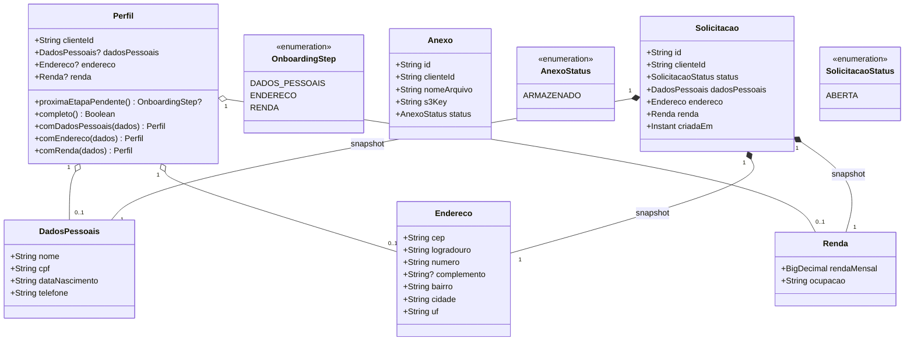

# Arquitetura

## Visão geral

O backend (ECS) emite e valida o próprio JWT (HS256, segredo simétrico via `JWT_SIGNING_SECRET`) —
sem Cognito nem qualquer validador upstream no API Gateway (ver
`docs/decisions/0007-jwt-proprio-sem-cognito.md`). `POST /api/auth/signup` e `POST /api/auth/login`
são os únicos endpoints públicos (`permitAll`); todo o resto exige o JWT no header `Authorization`.

## Padrão hexagonal (repete nas 3 capabilities: Perfil, Anexo, Solicitação)

`domain/` (Perfil, Anexo, Solicitação e seus value objects) não depende de nada do Spring nem do
AWS SDK — só `application/` e os `adapter/*` conhecem framework/infra.

Pacotes usam `input`/`output`, não `in`/`out`: essas duas palavras são reservadas em Kotlin.

## Modelo de domínio

`Perfil` guarda os dados como opcionais — cada etapa do wizard preenche um campo por vez (draft
incremental). `Solicitacao` guarda uma **cópia** (snapshot) desses dados no momento da criação:
se o cliente editar o perfil depois, solicitações já criadas não mudam retroativamente.

## Persistência: DynamoDB single-table

Uma tabela, chaves compostas — sem GSI de operador (só o próprio cliente consulta as suas):

| PK | SK | Uso |
|---|---|---|
| `CLIENTE#{id}` | `PROFILE` | Perfil (dados pessoais + endereço + renda + estado de draft) |
| `CLIENTE#{id}` | `SOLICITACAO#{id}` | Uma solicitação |
| `CLIENTE#{id}` | `ANEXO#{id}` | Metadata do anexo (S3 key, status) |

O isolamento entre clientes vem da própria chave, não de checagem de ownership em código: uma
busca com `clienteId` de outro cliente simplesmente não encontra o item (não existe "buscar
solicitação só pelo id", só "buscar solicitação do cliente X pelo id").

## Decisões de design

Ver [`docs/decisions/`](decisions/) para o raciocínio por trás de cada escolha não-óbvia.

## Fora de escopo

Deploy real em conta AWS não faz parte deste projeto — a infra Terraform (`infra/terraform/`) é
AWS-alvo e fica pronta pra aplicação, mas nunca foi executada contra uma conta real. Validação de
ponta a ponta é só local, via ministack. Um gap conhecido dessa limitação: suporte do ministack a
NLB/VPC Link não é confirmado (ver `infra/README.md`), então esse trecho específico do roteamento
nunca foi validado na prática.
